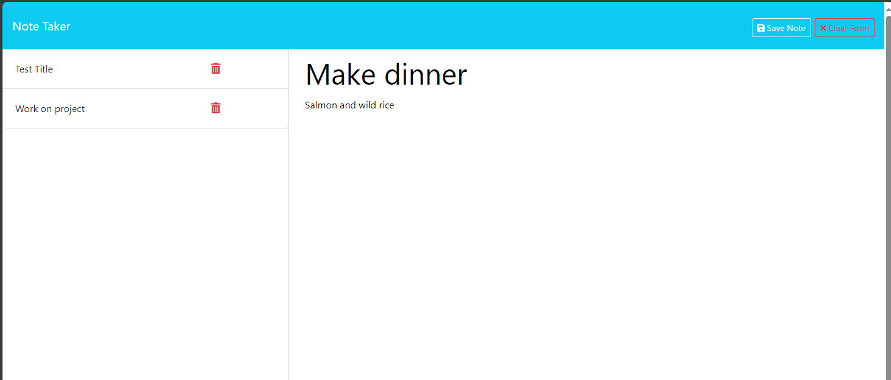

# note-taker

## Description
This project uses HTML and API calls to save and retrieve notes. I was responsible for the back-end code such as the GET requests for both HTML files and APIs, and the POST request for the notes API. The code saves each new note to the json file and renders it on the page.

## Usage
Deployed application:  https://limitless-refuge-95387-9df5404df67f.herokuapp.com/
